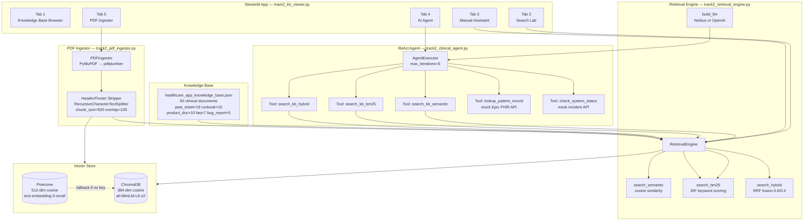
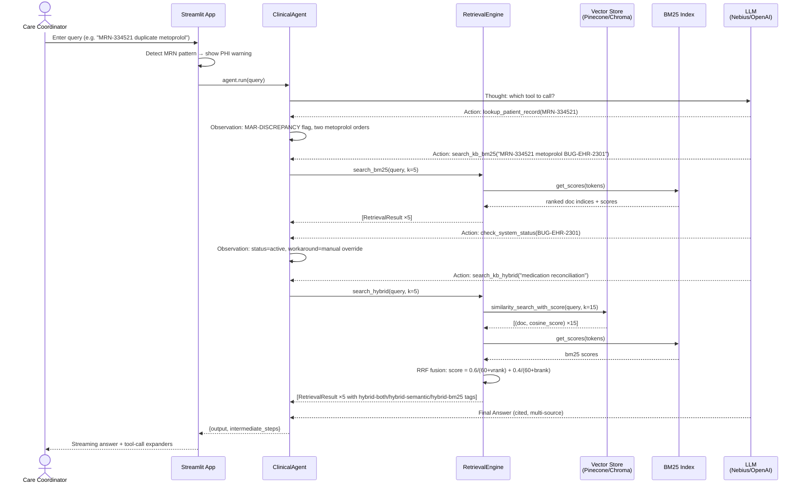
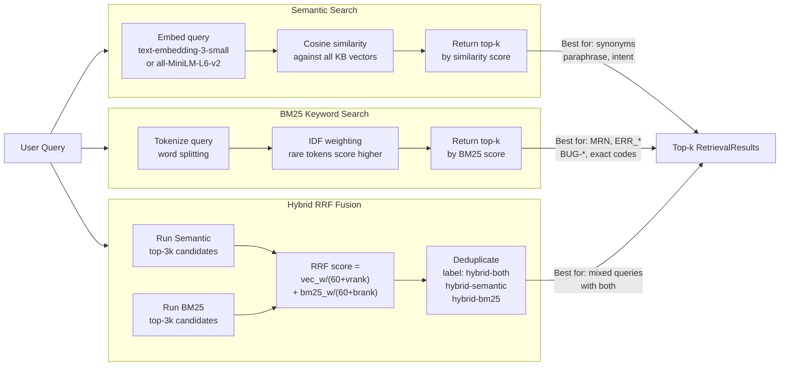
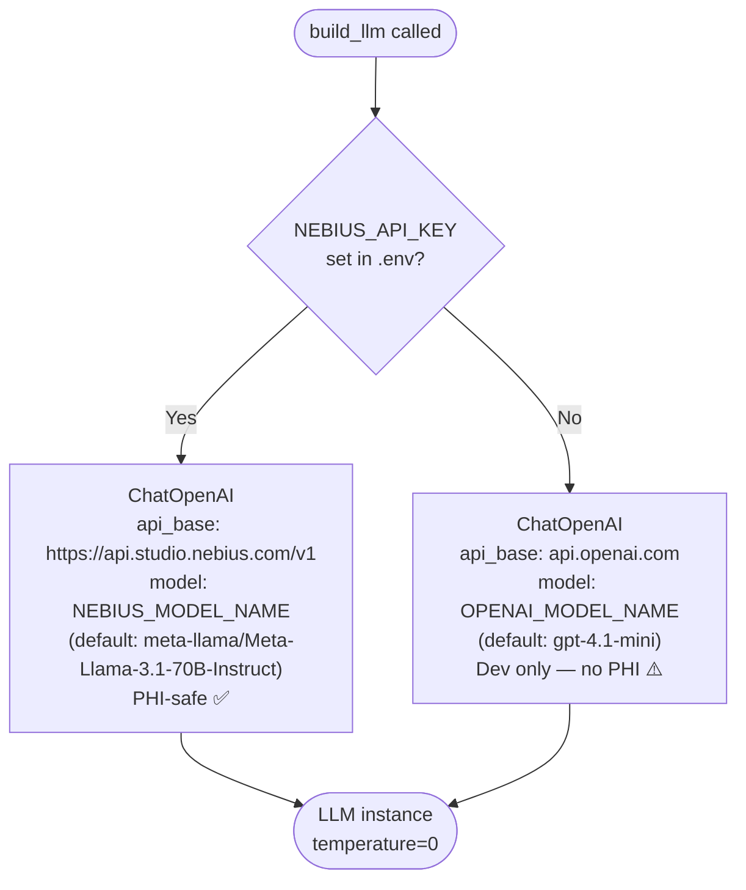
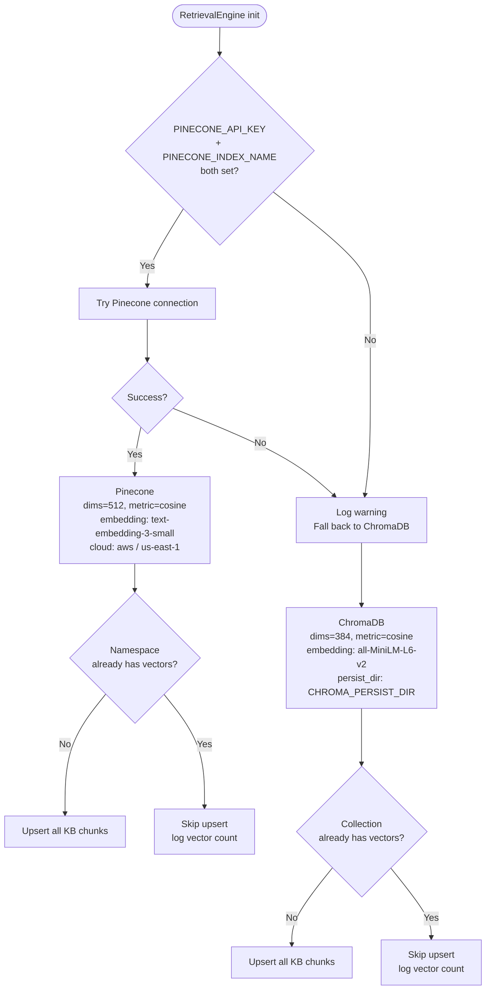
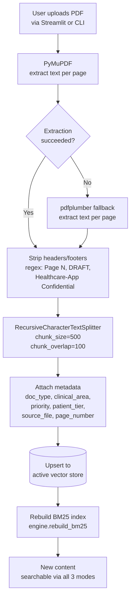

# Healthcare-App — System Design Diagrams

## 1. Component Architecture

---

## 2. Data Flow — Query Processing

---

## 3. Retrieval Mode Comparison

---

## 4. LLM Backend Selection

---

## 5. Vector Store Selection

---

## 6. PDF Ingestion Flow

---

## Environment Variables Quick Reference

| Variable | Default | Effect |
|----------|---------|--------|
| `OPENAI_API_KEY` | — | Enables OpenAI cloud LLM |
| `OPENAI_MODEL_NAME` | `gpt-4.1-mini` | OpenAI model to use |
| `NEBIUS_API_KEY` | — | Activates Nebius AI Studio (PHI-safe) |
| `NEBIUS_MODEL_NAME` | `meta-llama/Meta-Llama-3.1-70B-Instruct` | Nebius model |
| `PINECONE_API_KEY` | — | Enables Pinecone cloud vector store |
| `PINECONE_INDEX_NAME` | — | Pinecone index (dims=512, cosine) |
| `CHROMA_PERSIST_DIR` | `./chroma_db` | ChromaDB persistence directory |
